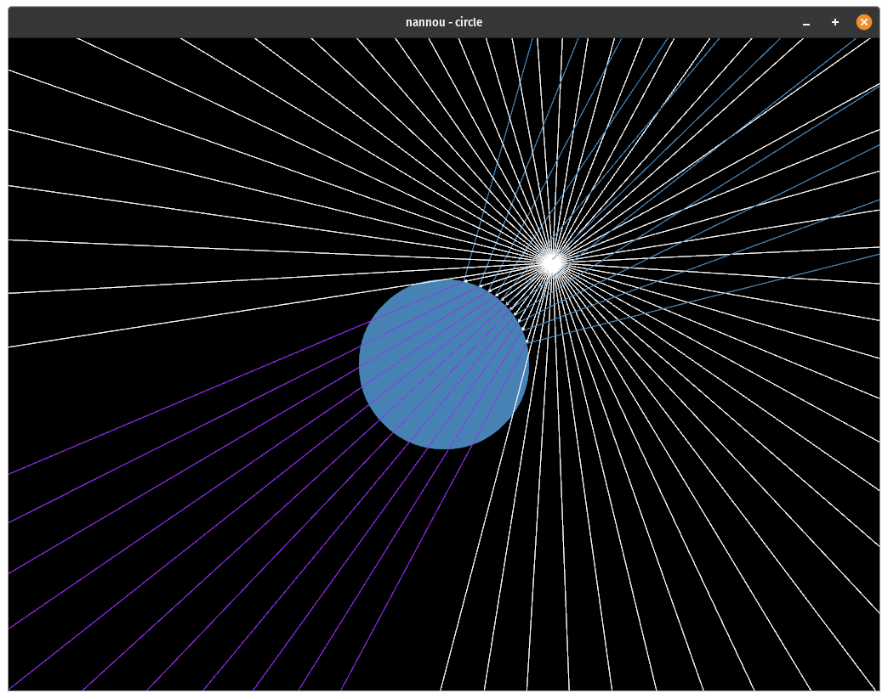

# Nannou Raycast

Nannou Raycast is a simple library to test in [nannou](https://github.com/nannou-org/nannou), the intersection between a ray and 2D segments, lines, circles and to calculate reflections and refractions. At the moment, just 2D rays are implemented.

## Example

You can run the following example with `cargo run --example circle`

